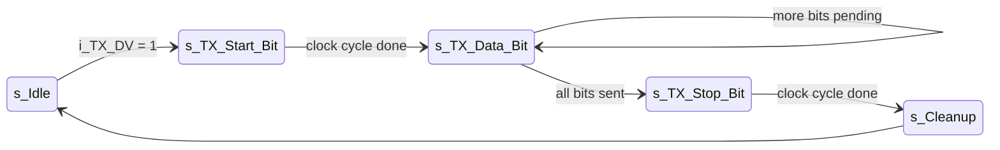
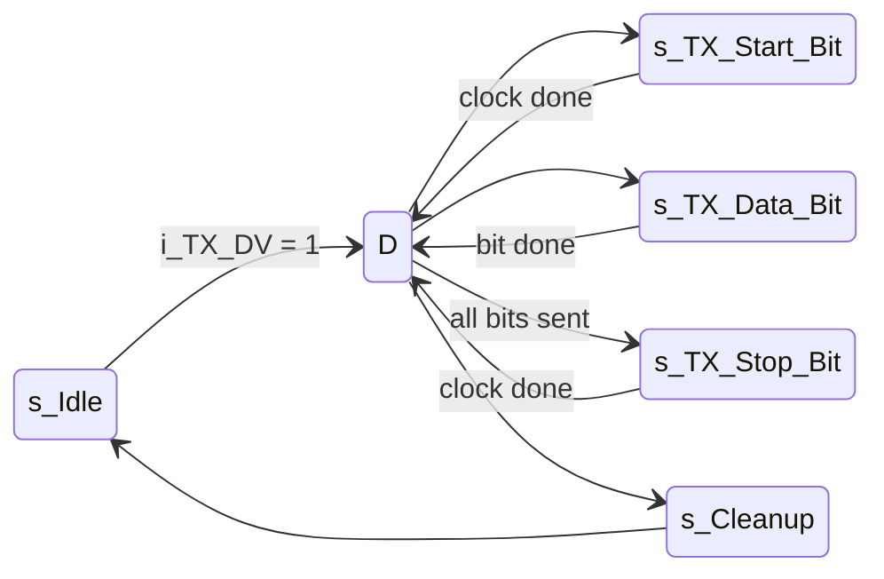

# Refactoring and Redesigning Nandland UART Transmitter - FSM Architecture Improvement (VHDL)
---
🧠 Overview

This project contains a refactored and timing-friendly version of the classic Nandland UART transmitter implemented in VHDL. The main goal was to separate the functional FSM actions from baud-rate timing, making the design cleaner, easier to maintain, and more timing-robust on FPGA devices.

The original FSM mixed timing delays and functional logic inside the same states. This refactor introduces a dedicated timing state (“D”) that centralizes baud-counter handling.

---

## 🔧 What Changed

- Converted the original 5-state FSM into a cleaner 6-state architecture.
- Added a transient timing state (D) that handles baud-cycle waiting.
- Each functional state now performs a single action and immediately hands control to D.
- Reduced combinational depth inside each state.
- Preserved original UART framing (1 start, 8 data, 1 stop).

---
## Original FSM (Nandland Style)

This approach works, but it mixes functional logic and timing logic inside the same state, increasing the combinational depth and complexity.
---
## 🔧 Refactored and Redesigned FSM (This Repo)

The design introduces a dedicated timing state **D**, which is responsible for waiting the required baud-cycle duration.  
Each functional state now performs **one operation only**, and then hands control to **D** to enforce timing.

