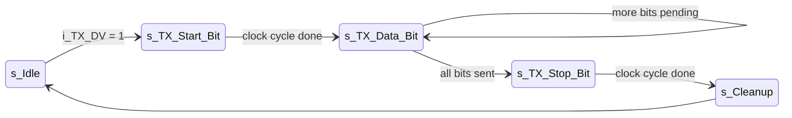
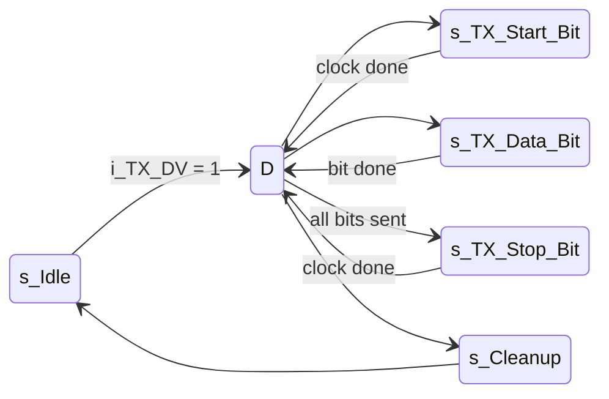

Refactoring Nandland UART Transmitter — FSM Architecture Improvement (VHDL)

This project is a rewritten and optimized version of the classic Nandland UART TX VHDL implementation.
The original design used a five-state FSM, where each state performed both the operation and the internal timing delay:

This approach works, but it mixes functional logic and timing logic inside the same state, increasing the combinational depth and complexity.
🔧 What I Changed

I refactored the UART TX FSM into a cleaner, more modular, and more timing-friendly 6-state architecture:

D – Handles the baud-rate timing counter
(waits for the required number of clock cycles before moving to the next operation)
